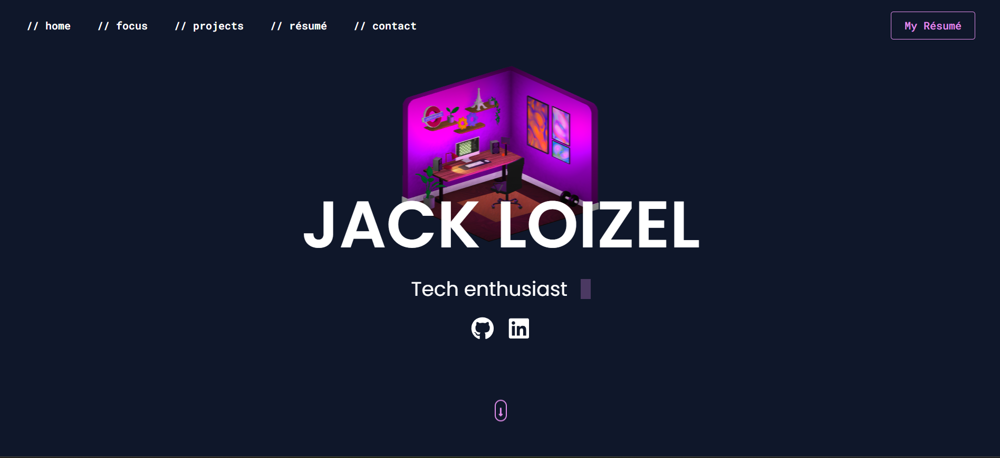

<!-- PROJECT LOGO -->
 

  

<h3 align="center">Personal Portfolio Website</h3>

  

    This is my personal portfolio website built to showcase my design and development skills. It features multiple sections including a bio, project gallery, and contact form. I created this portfolio to have a place where I can present my projects and share my journey.
     
    <a href="https://github.com/jloizel/jloizel.github.io"><strong>Explore the docs »</strong></a>
     
     
    <a href="https://www.jackloizel.com/">View Live Project</a>
    ·
    <a href="https://github.com/jloizel/jloizel.github.io/issues/new?labels=bug&template=bug-report---.md">Leave some feedback</a>
<!--     ·
    <a href="https://github.com/jloizel/jloizel.github.io/issues/new?labels=enhancement&template=feature-request---.md">Request Feature</a> -->
  

<!-- ABOUT THE PROJECT -->
## 📝 About The Project

This project is a personal portfolio website created to showcase my skills and projects as a software engineer. It serves as a central hub for potential employers, collaborators, and clients to explore my work.

The goal was to build a modern, responsive, and visually appealing site that reflects both my technical abilities and creative approach, while ensuring a seamless user experience across devices.

The portfolio highlights my projects, demonstrates my proficiency in various tools and frameworks, and provides an easy way to get in touch via the contact form. Key features include responsive design, a dynamic project gallery, and a user-focused interface.

### Built With (***non-exhaustive***)

<code></code>
<code></code>
<code></code>
<code></code>

(<a href="#readme-top">back to top</a>)

